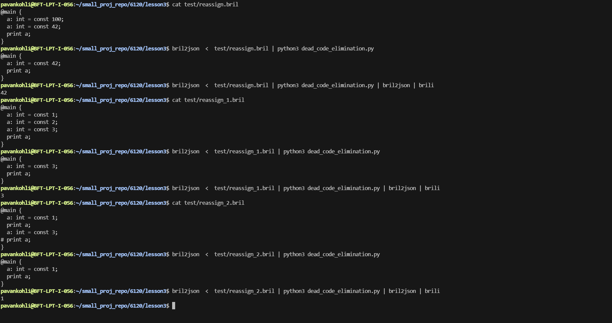
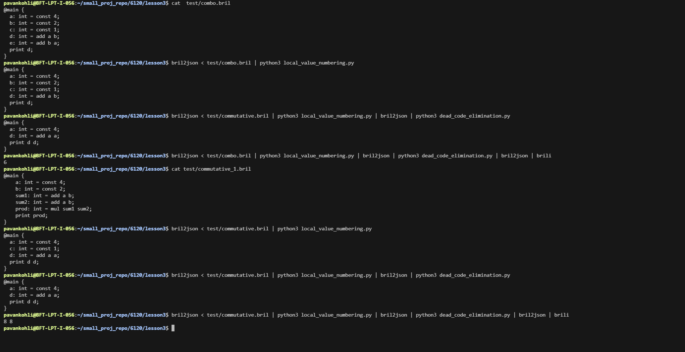
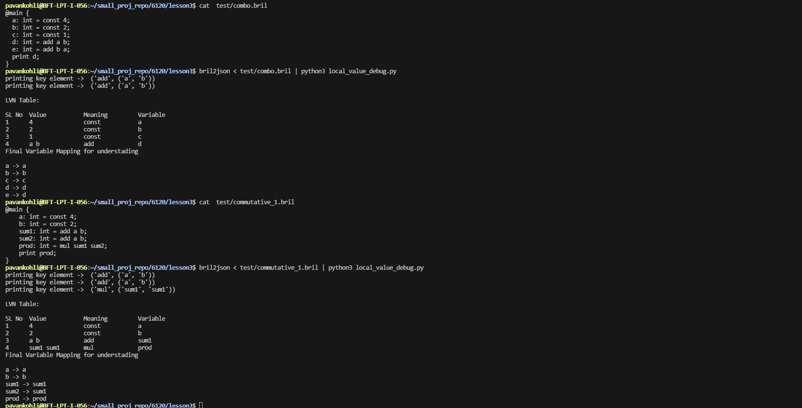

# COMPILER OPTIMIZATIONS: DEAD CODE ELIMINATION (DCE), LOCAL VALUE NUMBERING (LVN), COMMON SUBEXPRESSION ELIMINATION (CSE)

---

# DEAD CODE ELIMINATION (DCE)

Dead Code Elimination works by reading instructions from bottom to top using backward traversal. It tracks variables that are needed in future instructions. If a variable is not used later in the program, it is considered dead code and can be removed. Otherwise, it must be kept.

Dead code means a variable whose value is overwritten or never used later in the program execution. A variable used before being overwritten cannot be deleted.

---

## Example 1 (NOT deletable)
```
a = 5  
print a  
a = 10  
```

Explanation: a = 5 is used in print a before overwrite, so it cannot be deleted.

---

## Example 2 (deletable)
```
a = 10  
a = 20  
print a  
```

Explanation: a = 10 is overwritten before use, so it is dead code.

---

## Visualization



---

# LOCAL VALUE NUMBERING (LVN)

LVN eliminates redundant computations by focusing on values instead of variables inside a basic block. Each expression is assigned a canonical representation so repeated computations can be reused instead of recomputed.

---

## Example
```
Before LVN:  
t1 = a + b  
t2 = a + b  

After LVN:  
t1 = a + b  
```

---

## Visualization



---

# COMMON SUBEXPRESSION ELIMINATION (CSE)

Commutative property 

CSE removes duplicate expressions that compute the same value. If an expression has already been computed, it is reused instead of recomputing it.

For add and mul, commutative property applies so a + b is same as b + a. To handle this, arguments are normalized using sorting.

---

## Example
```
Before CSE:  
t1 = a + b  
t2 = b + a  


After CSE:  
t1 = a + b  
```

No need to add t2 because we are linking t2 to t1 in expression table
---

## Visualization



---

# IMAGE DIRECTORY

images/
- DEAD_CDE_ELIMINATION.png
- LOCAL_VALUE_NUMBERING.png
- FORMAT_STORED_INFO_PIC.png

---

# SUMMARY

DCE removes dead instructions, LVN removes repeated computations, and CSE eliminates duplicate expressions using normalization and reuse of computed results.
